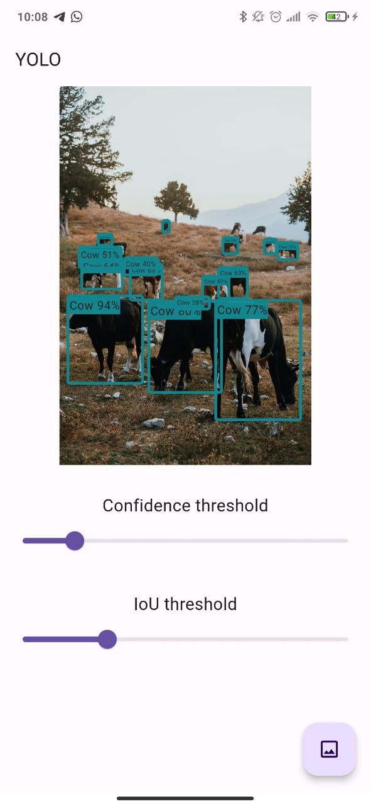
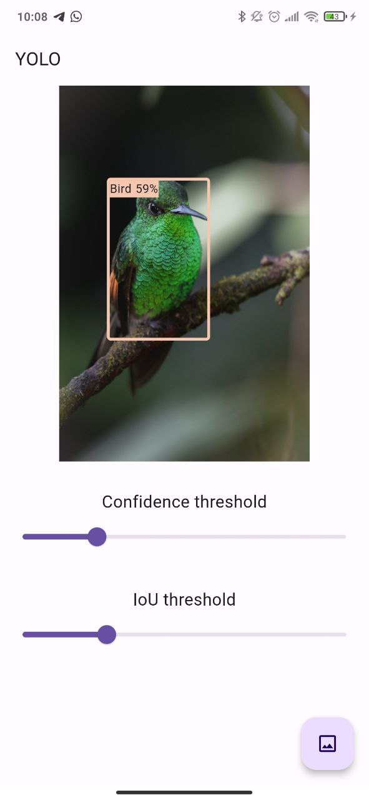

# yolo_flutter

An example project using the official [`tflite_flutter`](https://pub.dev/packages/tflite_flutter)
package from the Tensorflow team to run YOLO (a fast object detection model).
This example is complete: it embeds the non-max suppression algorithm I wrote in
Dart.

    
    

## Supported platforms
Platform support depends on the [`tflite_flutter`](https://pub.dev/packages/tflite_flutter)
package. Theoretically the app could be compiled for Android, iOS, Linux,
Windows and MacOS. I have only tested it on Android and Linux. Please submit a
PR if the implementation on the other OSs is broken.

## How to compile it
- [Install flutter](https://docs.flutter.dev/get-started/install)
- [Install the ultralytics Python package](https://docs.ultralytics.com/quickstart)
- Export the yolo model to tflite, e.g. `yolo export model=yolov8n.pt format=tflite`
- Place the output model in the `assets/models` folder as `yolov8n.tflite`
- Compile the app with `flutter build apk --release`

## FAQ

### Can I test the app without compiling it?
You can find the latest version of the app for Android and Linux on the Github
[release page](https://github.com/ferraridamiano/yolo_flutter/releases).

### Can I run my custom object detection model?
Yes, place your model in the assets/models folder and change the labels inside
the `lib/labels.dart` file.

### Does it work with all the versions of YOLO?
I tested it only with YOLOv8 but you could try and let me know. The most 
important thing is to make sure that the output format of the neural network
is the same as YOLOv8.

